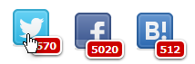

# jQuery POP'n SocialButton - Twitter, Facebook, はてなブックマークのカスタムシェアボタンを表示するjQueryプラグイン

上記のようなちょっと変わったシェアボタンを表示できます。

それぞれのボタンにマウスカーソルを合わせると、ボタンがピョコっと浮き上がります。

ボタンをクリックすると各サービスのシェア登録ページを、シェア数をクリックすると各サービスのコメント一覧ページを別ウインドウで開きます。ただし、Facebookはコメント一覧を見る方法がない(と思う)のでシェア数をクリックしてもシェア登録ページを開きます。

今のところの対応サービスは、日本でシェアボタンの主流になっている3サービス(Twitter, Facebook, はてなブックマーク)のみです(というか他のサービスのシェア数の取得方法が分からないだけだったりする)。

他のサービスのシェア数の取得方法とシェアリンクのURL・パラメータの情報を提供頂ければ追加するかもしれません。

## 使用方法

1. 同梱のjsディレクトリとimgディレクトリをサーバーに設置します(jsディレクトリ内の.coffeeファイルは必要ありません)。

2. HTML内でjquery.jsとjquery.popn-socialbutton.jsを読み込みます。

        
        

3. HTML内にシェアボタンを表示させたい空のエレメントを用意します。

        

4. Javascript内で上記エレメントに対して`popnSocialButton()`を実行します。

        $('#social-button').popnSocialButton([ 'twitter', 'facebook', 'hatebu' ]);

## $( *element* ).popnSocialButton(services[, options])

### __services__

表示させたいシェアボタンのサービス名を配列で指定します。

配列で指定した順番にシェアボタンを表示します。

#### サービス名一覧

* twitter
* facebook
* hatebu

### __options__ (省略可能)

表示をカスタマイズするオプションの連想配列を指定します。

* url

    シェアするURLです。デフォルトは現在のページのURLです。

* text

    シェア内容に付加するテキストです。デフォルトは現在のページのタイトルです。

* imgDir

    シェアボタンの画像があるディレクトリの場所を変更します。デフォルトは`'./img'`です。

* buttonSpace

    シェアボタンの表示間隔をpx単位で指定します。デフォルトは`12`です。

* countPosition

    シェア数の表示位置を連想配列で指定します(`top` or `bottom` と `left` or `right`の組み合わせ)。デフォルトは`{ top: 32, right: -12 }`です。

* countSize

    シェア数のフォントサイズを指定します。デフォルトは`10`です。

* countColor

    シェア数の文字色や背景色を連想配列で指定します。指定できる色は以下の通りです。

            countColor: {
              text: '#ffffff',       // 文字色です。
              bg: '#cc0000',         // 背景色です。
              textHover: '#ffffff',  // マウスポインタを合わせた時の文字色です。
              bgHover: '#ff6666',    // マウスポインタを合わせた時の背景色です。
              border: '#ffffff'      // 枠色です。
            }

シェア数に関してさらにカスタマイズをしたい場合はCSSで別途指定してください。

#### CSSでの別途指定例

    #social-button .popn-socialbutton-count {
      border-radius: 0 !important;
      box-shadow: none !important;
      border-width: 1px !important;
    }

オプションをはじめ、具体的な使用例は[example.html](example.html)をご覧ください。

## その他

内部で指定しているCSSのベンダープレフィックスはjQueryに任せています。

jQueryが自動でベンダープレフィックスを追加するようになったのはバージョン1.8からなので、それ以前のjQueryと合わせて使用する場合は利用者側でCSSで指定する必要があるかもしれません。

## 対応ブラウザ

* モダンブラウザ
* IE6以上([IETester](http://my-debugbar.com/wiki/IETester/HomePage)で確認)

ただしIE8以下では丸角や影を使用できないので見た目はあまり良くありません。

## 謝辞

* 各種サービスのシェア数取得に関しては<http://q.hatena.ne.jp/1320898356>を参考にさせて頂きました。
* 各種サービスのアイコンは[ヴォルフロッシュ様のミニ・ソーシャル・アイコン](http://wolfrosch.com/works/webdesign/socialicons)から利用させて頂きました。

## Changelog

### 0.1.1 (2013-04-04)

* シェア数をクリックすると各サービスのコメント一覧ページを開くようにした
* シェア数にマウスポインタを合わせると色が変わるようにした
* optionsのシェア数の色に関するオプション名および構造を変更

### 0.1.0 (2013-04-04)

* 初版リリース

## ライセンス

[MIT license](http://www.opensource.org/licenses/mit-license)で配布します。

&copy; 2013 [ktty1220](mailto:ktty1220@gmail.com)
